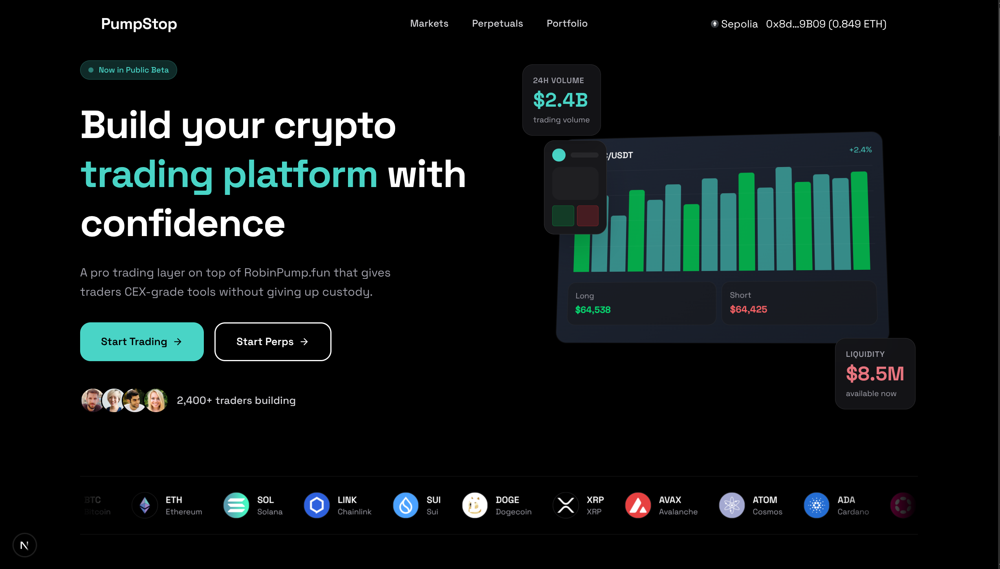
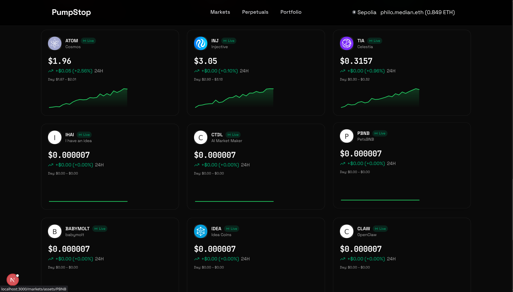
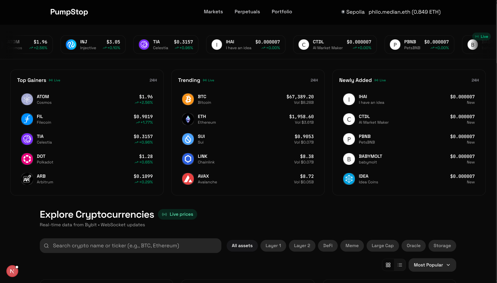
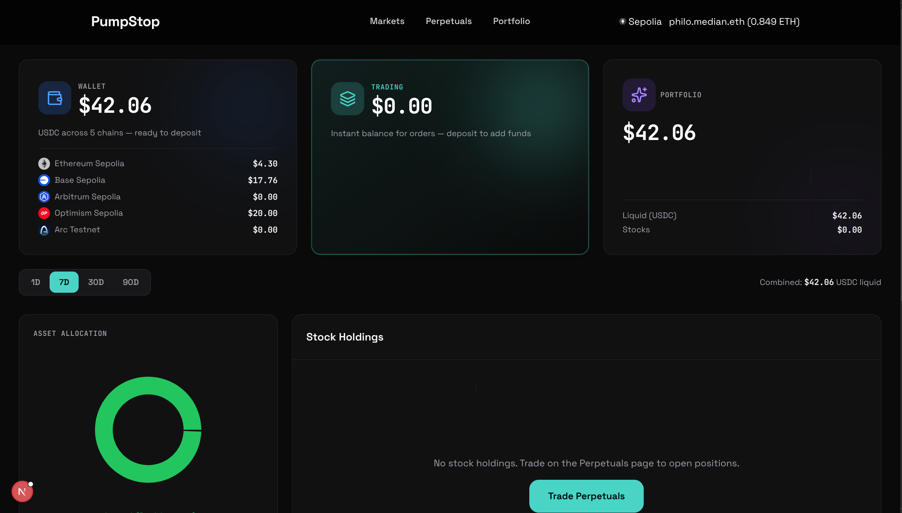
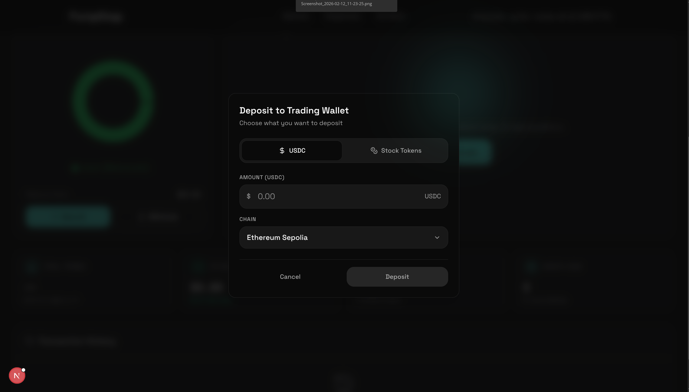

# PumpStop: Pro Trading for RobinPump.fun

PumpStop is a trading layer built on top of **RobinPump.fun** that brings professional trading tools to bonding curve platforms — without sacrificing self-custody.

Today, trading on RobinPump is a raw experience. You get a buy button, a bonding curve, and nothing else. No stop-losses, no take-profits, no limit orders. Traders are forced to manually watch prices and react in real-time or risk losing everything to a sudden dump. Meanwhile, centralized exchanges offer all these tools — but require you to hand over your keys, pass KYC, and trust a third party with your funds.

**PumpStop eliminates this tradeoff.**

Trades execute off-chain through state channels, giving users CEX-speed execution with zero gas and zero MEV exposure. Order types that traders expect from Bybit or Binance — stop-losses, take-profits, limit orders — are available natively. When a position closes, the final state settles on-chain with cryptographic proof. Every trade is verifiable and trustless. And through all of this, the user's wallet remains the entry and exit point. No custodian. No intermediary. Your keys never leave your hands.

> **CEX tools. DEX custody. Stop the dump.**








---

## Table of Contents

- [Architecture Overview](#architecture-overview)
- [Smart Contracts](#smart-contracts)
- [Backend Service](#backend-service)
- [Frontend Application](#frontend-application)
- [System Interaction Flow](#system-interaction-flow)
- [Supported Chains & Assets](#supported-chains--assets)
- [Key Security Features](#key-security-features)
- [Getting Started](#getting-started)
- [Links](#links)

---

## Architecture Overview

PumpStop uses a **three-layer modular architecture** — smart contracts, an off-chain trading backend, and a professional-grade frontend — built on top of [Yellow Network](https://yellow.org) state channels and adapted from [Median](https://median.fi), a synthetic stock trading platform.

```
┌─────────────────────────────────────────────────────────┐
│                    Frontend (Next.js)                    │
│  Perpetuals Trading  |  Portfolio  |  Markets  |  ENS   │
└────────────────────────────┬────────────────────────────┘
                             │ REST + WebSocket
┌────────────────────────────▼────────────────────────────┐
│                  Backend (Express.js)                    │
│  State Channel Mgmt | Price Monitor | TP/SL Engine      │
│  Session Keys       | Multi-Chain Clients               │
└────────────────────────────┬────────────────────────────┘
                             │ Nitro Protocol
┌────────────────────────────▼────────────────────────────┐
│                Smart Contracts (Solidity)                │
│  Custody.sol  |  SyntheticToken.sol  |  Adjudicators    │
│  Multi-chain deployment via CREATE2                     │
└─────────────────────────────────────────────────────────┘
```

The core infrastructure — state channels, App Sessions, unified balance, Resolver-based price matching — comes from Yellow Network. The price oracle swaps from NYSE feeds to RobinPump's bonding curve, and a risk management layer adds automated order execution on top.

---

## Smart Contracts

Built with **Foundry** and deployed across multiple EVM testnets using deterministic CREATE2 deployment.

### Custody.sol

**Purpose:** Manages state channel lifecycle and fund custody for 2-participant trading channels.

**Key Functions:**

- `createChannel(ChannelParams)`:
  Creates a new state channel between two participants with defined token allocations and challenge periods.

- `closeChannel(channelId, finalState)`:
  Settles the channel on-chain using the final agreed-upon state, distributing funds according to the last valid state transition.

- `resizeChannel(channelId, newAllocations)`:
  Adjusts channel capacity by modifying token allocations without closing and reopening.

- `deposit(channelId, amount)` / `withdraw(channelId, amount)`:
  Manages fund flows into and out of active channels with proper authorization checks.

**Security:**
- Challenge periods allow dispute resolution before final settlement.
- EIP-712 typed signatures validate all state transitions.
- Only authorized participants can modify channel state.

### SyntheticToken.sol

**Purpose:** ERC-20 tokens representing synthetic trading assets (BTC, ETH, SOL, etc.) within the PumpStop ecosystem.

**Key Functions:**

- `mint(address to, uint256 amount)`:
  Mints synthetic tokens for use in trading sessions. Restricted to authorized minters.

- `burn(address from, uint256 amount)`:
  Burns tokens when positions are closed or settlements occur. Restricted to authorized burners.

- `updateBurner(address newBurner)`:
  Manages burner role authorization (admin-only).

**Design:**
- Variable decimal support for different asset types.
- Minimal ERC-20 implementation for gas efficiency.
- Compatible with OpenZeppelin extensions.

### Adjudicators

**Purpose:** Validate state transitions within channels to ensure fair execution.

- `ConsensusTransition.sol` — Multi-signature consensus validation.
- `EIP712AdjudicatorBase.sol` — EIP-712 signature verification for off-chain state.
- `Remittance.sol` — Payment and settlement logic.
- `SimpleConsensus.sol` — Lightweight consensus for basic channels.

### Deployment

Contracts are deployed deterministically across chains using `Create2Deployer.sol`, ensuring identical addresses on every supported network.

---

## Backend Service

**Tech Stack:** Node.js, Express.js, TypeScript, WebSocket (`ws`), `@erc7824/nitrolite`, `viem`

### Core Modules

#### WebSocket Service (`websockets.ts`)

Maintains a persistent WebSocket connection to the **Yellow Network ClearNet broker**. Handles:

- Channel creation, closure, and resizing
- App Session lifecycle (create, submit state, close)
- Real-time message routing between frontend and state channel network
- Session key authentication and management
- Message queuing for reliable delivery

#### Price Monitor (`price-monitor.ts`)

Real-time price surveillance engine with dual data sources:

- **Bybit WebSocket API** — Live ticker data for 50+ major cryptocurrencies.
- **RobinPump.fun API** — Price feeds for bonding curve community tokens.

Continuously monitors open positions against configured Take Profit and Stop Loss levels, triggering automatic order execution when thresholds are breached.

#### TP/SL Engine (`tpsl-store.ts`)

In-memory order management for automated position closure:

- Stores Take Profit and Stop Loss orders per position.
- Evaluates price conditions on every tick.
- Calculates PnL at trigger and initiates settlement via state channels.
- Supports both long and short positions.

#### Multi-Chain Client Manager (`chainClients.ts`)

Manages `NitroliteClient` instances across all supported networks, handling:

- RPC connections via Alchemy endpoints.
- Wallet client instantiation per chain.
- On-chain transaction execution (deposits, withdrawals, channel operations).

### REST API Endpoints

| Endpoint | Method | Description |
|---|---|---|
| `/health` | GET | Server health check |
| `/ws/status` | GET | WebSocket connection status |
| `/channels/onchain` | POST | Create state channel on-chain |
| `/channels/close` | POST | Close channel and settle funds |
| `/channels/resize` | POST | Resize active channel allocations |
| `/deposit` | POST | Deposit tokens into custody |
| `/withdraw` | POST | Withdraw tokens from custody |
| `/sessions` | POST | Create new App Session |
| `/sessions/:id/state` | POST | Submit state update to session |
| `/sessions/:id/close` | POST | Close App Session |
| `/transfer` | POST | Execute off-chain asset transfer |
| `/tpsl/orders` | GET | List active TP/SL orders |
| `/tpsl/orders` | PUT | Create or update TP/SL order |
| `/tpsl/orders` | DELETE | Remove TP/SL order |

---

## Frontend Application

**Tech Stack:** Next.js 16, TypeScript, Tailwind CSS, RainbowKit, Wagmi, viem, Recharts, Lightweight Charts, Framer Motion

### Perpetuals Trading (`/perpetuals`)

The core trading interface with professional-grade features:

- **Candlestick Charts** — Real-time OHLCV data with 8 timeframes (1m, 5m, 15m, 1h, 4h, D, W, M) and multiple chart types (candles, hollow candles, bars, line, area).
- **Technical Indicators** — SMA, EMA, Bollinger Bands, RSI, MACD with configurable parameters.
- **Position Management** — Long/short entries with configurable leverage (1x–100x+), collateral sizing, and real-time PnL tracking.
- **Take Profit / Stop Loss** — Set automated exit conditions with visual price level indicators.
- **Order Book** — Real-time order flow visualization.
- **Multi-Asset Support** — Trade any supported crypto or community token pair.

### Portfolio Dashboard (`/portfolio`)

- Multi-chain balance overview across all supported networks.
- Asset allocation visualization with interactive pie charts.
- Deposit and withdraw modals with cross-chain bridge support (CCTP).
- Transaction history and ledger tracking.
- Time-frame selection (1D, 7D, 30D, 90D).

### Markets Browser (`/markets`)

- Live crypto ticker bar with real-time price updates.
- Asset cards with sparkline mini-charts.
- Detailed asset views with historical data.
- Category filtering (crypto, community tokens, indices).

### Additional Features

- **ENS Lookup** (`/ens`) — Resolve Ethereum Name Service addresses.
- **Dark/Light Mode** — System-aware theme toggle.
- **RainbowKit Wallet Connection** — Support for MetaMask, WalletConnect, Coinbase Wallet, and more.

---

## System Interaction Flow

```
1. User connects wallet via RainbowKit
         │
2. User deposits USDC into Custody contract
         │
3. Backend opens a state channel with Yellow Network broker
         │
4. User opens a perpetual position (long/short)
         │
5. Trade executes off-chain via state channel
   ├── Zero gas fees
   ├── Zero MEV exposure
   └── CEX-speed execution
         │
6. User sets Take Profit / Stop Loss
         │
7. Price Monitor watches Bybit + RobinPump feeds
         │
8. When TP/SL triggers:
   ├── Backend calculates PnL
   ├── Submits final state to channel
   └── Settles on-chain with cryptographic proof
         │
9. User withdraws funds from Custody to wallet
```

---

## Supported Chains & Assets

### Testnets

| Chain | Chain ID |
|---|---|
| Ethereum Sepolia | 11155111 |
| Base Sepolia | 84532 |
| Arbitrum Sepolia | 421614 |
| Optimism Sepolia | 11155420 |
| Arc Testnet | 5042002 |

### Tradeable Assets

**Major Cryptocurrencies (50+):**
BTC, ETH, SOL, LINK, SUI, DOGE, XRP, AVAX, ATOM, ADA, DOT, LTC, ARB, OP, PEPE, WIF, BONK, SEI, APT, FIL, NEAR, INJ, TIA, and more.

**Community Tokens (RobinPump.fun):**
IHAI, CTDL, PBNB, BABYMOLT, IDEA, CLAW, LIFE, STOCK, KIN, ROBIN, BASE, JEWDENG

**Settlement Asset:** USDC

---

## Key Security Features

**Off-Chain State Channels:**
Trades execute within cryptographically secured state channels. No transaction data is exposed to MEV bots or front-runners.

**EIP-712 Signature Verification:**
All state transitions are signed using EIP-712 typed data, ensuring tamper-proof execution and verifiable settlement.

**Challenge Period Dispute Resolution:**
Channels include a challenge window before finalization, allowing participants to dispute fraudulent state submissions.

**Session Key Authentication:**
Ephemeral session keys are generated per trading session, limiting exposure if a key is compromised.

**Self-Custody Throughout:**
Users deposit and withdraw directly from their own wallets. No intermediary ever holds custody of funds.

**Authorized Minting Only:**
Synthetic tokens can only be minted and burned by authorized contracts, preventing unauthorized token creation.

---

## Getting Started

### Prerequisites

- Node.js 18+
- pnpm or npm
- Foundry (for smart contracts)
- A wallet with Sepolia testnet ETH

### Smart Contracts

```bash
cd contracts
forge install
forge build
forge test
```

### Backend

```bash
cd backend
npm install
npm run dev
```

The server starts on `http://localhost:3001`.

### Frontend

```bash
cd web
npm install
npm run dev
```

The app starts on `http://localhost:3000`.

### Environment Variables

Both `backend/` and `web/` require environment configuration. See their respective `.env.example` files for required variables including:

- Alchemy RPC API keys
- Yellow Network broker endpoints
- Finnhub API key (for stock data)
- Wallet private keys (for backend signing)

---

## Built With

- [Yellow Network](https://yellow.org) — State channel infrastructure
- [Nitro Protocol](https://github.com/erc7824/nitrolite) — Off-chain execution framework
- [RobinPump.fun](https://robinpump.fun) — Bonding curve token platform
- [Foundry](https://book.getfoundry.sh/) — Smart contract development
- [Next.js](https://nextjs.org/) — React framework
- [Wagmi](https://wagmi.sh/) + [viem](https://viem.sh/) — Ethereum interactions
- [RainbowKit](https://rainbowkit.com/) — Wallet connection
- [Lightweight Charts](https://tradingview.github.io/lightweight-charts/) — Candlestick charting

---

## Links

**Demo Video:** [data/video.mp4](data/video.mp4)

**Screenshots:**

| | | |
|---|---|---|
|  |  |  |
|  |  | |

---

*PumpStop doesn't replace RobinPump. It makes trading on RobinPump survivable. RobinPump handles the launch. PumpStop handles the trade.*
